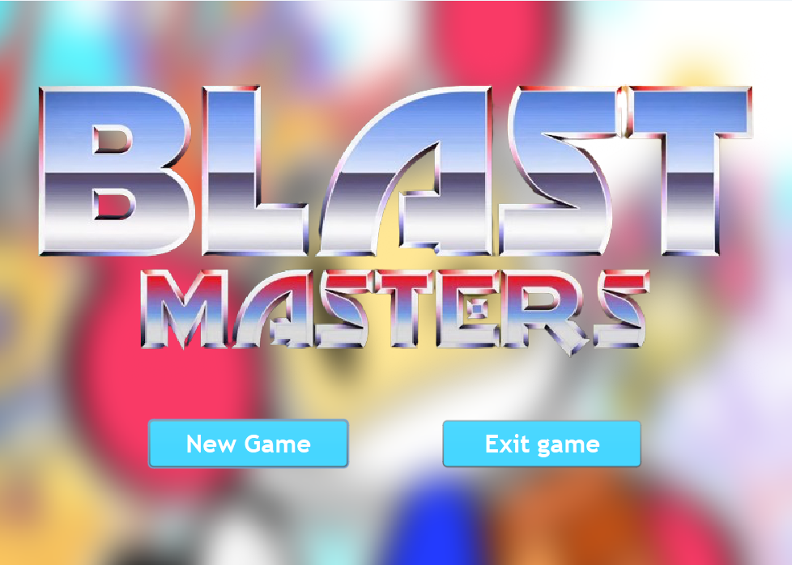
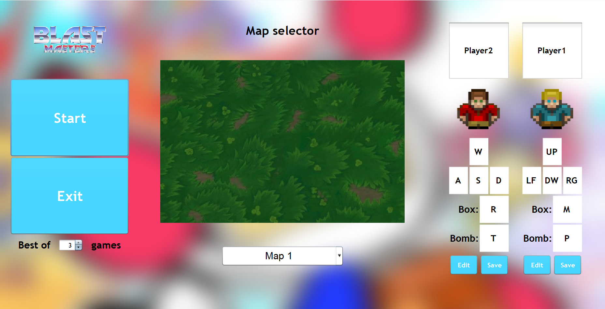

# Blast Masters

## Fedezd fel a Blast Masters világát!

### 🎮 Készen állsz az akcióra?
Merülj el az ikonikus Bomberman klasszikusra épülő, dinamikus Blast Masters játékban, ahol minden lépés döntő jelentőségű és csak a legkiválóbb stratégák maradhatnak talpon!

### ⚔️ Légy TE a legjobb stratéga!
Használd bombáidat okosan! Robbantsd fel a dobozokat, és szerezd meg a bennük rejlő bónuszokat, hogy minél erősebben szállhass szembe ellenfeleddel a végső küzdelemben. Vigyázz, mert minden sarokban veszély leselkedhet rád!

### 👾 Szörnyek a közelben...
Nem csak az ellenfeled jelent fenyegetést, szörnyek is leselkednek rád minden sarkon. Maradj éber, kerüld el vagy semmisítsd meg őket, hogy küzdhess a győzelemért!

### 💥 Kalandra fel! 
Válj te is mesterévé a Blast Masters világának. Fedezd fel a stratégiai gondolkodás és a gyors reakciók izgalmas kombinációját. Hívd ki barátaidat, és derüljön ki, ki tudja legtovább fenntartani a dominanciát ebben a robbanásokkal teli játékban! Kattints, és kezdd el a játékot még MA!

## Mi vár ránk egy kör alatt a Blast Masters-ben?
-**Játékosok mozgása**: A játékosoknak egyrészt lehetőségük van arra, hogy ügyesen navigáljanak a dinamikusan változó játéktéren elkerülve a veszélyes szörnyeket és a lehelyezett bombákat, másrészt arra, hogy ellenfelüket is kijátsszák, miközben stratégiailag fontos bónuszokat gyűjtenek be.

-**Bombák elhelyezése**: A játékosok bombákat helyezhetnek el a pálya különböző pontjain. Ezek a bombák nem csak kárt okoznak a környező dobozokban, hanem a szörnyeket is képesek elpusztítani vagy akár az ellenfél játékost is, ezáltal növelve a taktikai mélységet és a játék izgalmát.

-**Bónuszok gyűjtése**: A játék során felbukkanó különféle bónuszok (például a sebességnövelő vagy a robbanási zónát megnövelő bónusz) jelentős előnyt biztosíthatnak. Ezek a bónuszok gyökeresen megváltoztathatják a játékmenet dinamikáját és nagyban növelhetik a játékosok esélyeit a győzelemre.

-**Ellenségek legyőzése**: A játékosok használhatják bombáikat akadályok eltávolítására, továbbá ellenfelük és a pályán csatangoló szörnyek taktikus megsemmisítésére is. Ellenfél játékos felrobbantása pont(ok)hoz, egyúttal játékbeli előnyhöz juttatja a játékost.

-**Támadások kivédése**: A játékosoknak ébernek kell lenniük a bombák és támadások terén, folyamatosan figyelniük kell a többi játékos cselekedeteit, és gyorsan kell reagálniuk, hogy elkerüljék az ellenfél támadásait és csapdáit.

-**Taktikai döntéshozatal**: A játék során a játékosoknak alaposan meg kell fontolniuk minden lépésüket. Elengedhetetlen, hogy előre gondolkodjanak, hol és mikor helyezzenek el bombákat, és hogyan használják ki a legjobban a megszerzett bónuszokat, hogy maximalizálják hatékonyságukat a játékban.

## Pillants be a Blast Masters játékba!

### Főmenü

### Indítási és kezelési felület

### Játék közbeni képernyő

## Szerzők
<ul>
<li><h3>Kovács Máté </h3></li>
<li><h3>Seregi Péter </h3></li>
<li><h3>Tóth Levente </h3></li>
<li><h3>Varga Boldizsár</h3></li>
</ul>

## Licencszerződés
A szoftver a GNU Általános Nyilvános Licenc (GNU GPL) 3.0 verziója alatt van licencelve, amely egy ingyenes, copyleft licenc, szoftverek és egyéb művek számára. Ez a licenc biztosítja a felhasználók szabadságát a szoftver másolására, terjesztésére és módosítására, célja, hogy a szoftver minden felhasználója számára ingyenes maradjon. A licenc hangsúlyozza, hogy a szoftver használata során nem az ár, hanem a szabadság a mérvadó. A felhasználóknak bizonyos felelősségekkel is szembe kell nézniük, amennyiben másolatokat terjesztenek vagy a szoftvert módosítják, ezek a felelősségek mások szabadságának tiszteletben tartását követelik meg.

## Adatvédelmi nyilatkozat
### Bevezetés
Köszönjük, hogy a Blast Masters játékot választottad! Az adatvédelem kiemelten fontos számunkra, ezért szeretnénk tájékoztatni arról, hogy hogyan kezeljük az adatokat játékunk során.

### Adatkezelési elveink
A Blast Masters játék során nem gyűjtünk, nem tárolunk és nem továbbítunk semmilyen személyes adatot külső szerverekre. A játék használata közben keletkező összes adat (pl. játékbeli beállítások, eredmények) kizárólag a saját eszközödön kerülnek feldolgozásra és tárolásra.

### Személyes adatok kezelése
Mivel a játék nem gyűjt személyes adatokat, így nincs szükség külön intézkedésekre a személyes adatok védelmében. A játék használata teljes mértékben anonim, és nem kötődik személyes adatokhoz.

### Biztonság
Bár a játék nem tárol személyes adatokat, elkötelezettek vagyunk amellett, hogy biztosítsuk az eszközödön tárolt adatok biztonságát. A játék fejlesztése során folyamatosan ügyelünk arra, hogy az adatok védelme megfeleljen a legújabb technológiai követelményeknek.

### Adatvédelmi jogok
Mivel nem gyűjtünk személyes adatokat, így nem áll módunkban semmilyen adatot megtekinteni, módosítani vagy törölni. Amennyiben kérdésed van adatkezelési gyakorlatunkkal kapcsolatban, keress minket bizalommal az alábbi elérhetőségen.

### Elérhetőség
Ha további kérdéseid vannak az adatvédelmi gyakorlatunkkal kapcsolatban, kérjük, írj nekünk a support@blastmastersgame.com címre.

### Módosítások
Fenntartjuk a jogot, hogy bármikor módosítsuk ezt az adatvédelmi nyilatkozatot. Az új nyilatkozat hatálybalépését követően a játék használatával elfogadod a módosított feltételeket. Az aktuális adatvédelmi nyilatkozat mindig elérhető lesz a játék weboldalán.

**Köszönjük, hogy a Blast Masters-t választottad, és kellemes szórakozást kívánunk!**
